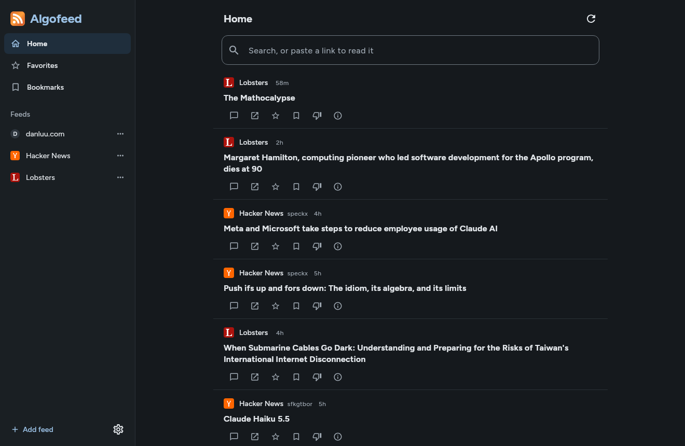

<p align="center">
  
</p>

<h1 align="center">Algofeed</h1>

<p align="center">
  <strong>A feed reader that ranks what you follow, for desktop and Android.</strong>
</p>

<p align="center">
  <a href="https://github.com/Jean-Couscous/algofeed/actions/workflows/release.yml"></a>
  <a href="https://github.com/Jean-Couscous/algofeed/releases/latest"></a>
  <a href="LICENSE"></a>
</p>

<p align="center">
  
</p>

---

Algofeed puts everything you subscribe to (blogs, Reddit, Hacker News, Mastodon, YouTube and more) in one Home stream. Instead of newest first, Home mixes freshness with what you actually read, and lets feeds that post rarely surface above busy ones, following [feedi](https://github.com/facundoolano/feedi)'s approach. Everything runs on your device: no account, no server, no tracking.

## Features

- **One ranked Home** — mixes freshness, quiet feeds, the feeds and authors you engage with, and how close a post is to your interests, matched semantically across languages by an on-device embedding model. Each entry's info button shows why it ranks where it does.
- **Learns from use** — opening, reading for 30 seconds, liking and bookmarking pull related entries up; "Show less like this" and scrolling past push them down.
- **Many sources** — RSS, Atom and RDF; Reddit subreddits and public custom feeds; Hacker News; Kagi News; Lobsters; Mastodon accounts and hashtags; YouTube channels.
- **Reader view** — articles extracted to clean text, comment threads for Hacker News and Reddit, and image posts shown as images.
- **Hacker News account** — optional login to upvote, reply and comment from the reader.
- **Android** — background refresh (optionally only on Wi-Fi or while charging), a home-screen widget, share-a-link-to-subscribe, wallpaper colors on Android 12+.
- **Desktop** — keyboard shortcuts, Firefox-style smooth scrolling, middle-click autoscroll.
- **Portable subscriptions** — OPML import and export.

## Install

Download from the [latest release](https://github.com/Jean-Couscous/algofeed/releases/latest).

| Platform | File | Requirements |
| --- | --- | --- |
| Android | `algofeed-<version>.apk` | Android 8.0 or later, arm64 (any current phone) |
| Arch Linux | `algofeed-<version>-1-x86_64.pkg.tar.zst` | x86_64; uses Arch's `jre21-openjdk` |
| Other Linux | `Algofeed-<version>-x86_64.AppImage` | x86_64; bundles its own Java |

```bash
# Android, from a computer with USB debugging enabled on the phone
adb install algofeed-<version>.apk

# Arch Linux (pulls in jre21-openjdk and adds Algofeed to the app menu)
sudo pacman -U algofeed-<version>-1-x86_64.pkg.tar.zst

# AppImage
chmod +x Algofeed-<version>-x86_64.AppImage
./Algofeed-<version>-x86_64.AppImage
```

On the phone itself, opening the APK works too; Android asks once to allow installs from the app you opened it with. The APK is per-ABI: `algofeed-<version>.apk` is arm64-v8a; `algofeed-<version>-x86_64.apk` is for emulators. There are no Windows or macOS builds; see [Build from source](#build-from-source).

### Arch Linux, as a pacman repo

To install and update through `pacman` instead of downloading each package by hand, add the releases as a third-party repository. Append to `/etc/pacman.conf`:

```ini
[algofeed]
SigLevel = Optional TrustAll
Server = https://github.com/Jean-Couscous/algofeed/releases/latest/download
```

Then:

```bash
sudo pacman -Sy algofeed
```

The packages aren't signed, hence `TrustAll`. `releases/latest/download` always resolves to the newest release, so `sudo pacman -Syu` upgrades Algofeed along with the rest of the system.

## Usage

### Adding feeds

"Add feed" in the sidebar accepts:

| Input | Source |
| --- | --- |
| a site or feed URL | RSS, Atom or RDF; site pages are searched for a `<link rel="alternate">` feed |
| `r/kotlin`, `reddit.com/r/kotlin/top`, `u/someone/m/feed` | Reddit listing or public custom feed |
| `hn`, an `hnrss.org` URL | Hacker News, with discussion links |
| `kagi`, `kagi:tech`, `kagi technology`, a `news.kagi.com` URL | Kagi News category (World by default) |
| `lobsters`, `lobste.rs/t/rust` | Lobsters front page or tag |
| `@user@server`, `#tag@server`, `https://server/@user` | Mastodon account or hashtag |
| `youtube.com/@handle`, `/channel/UC…` | YouTube channel |
| `nexus:skyrimspecialedition`, `/updated`, a `nexusmods.com/<game>` URL | Nexus Mods newest, updated or trending mods for a game (needs an API key) |

Pasting a URL into the search box opens it in the reader without subscribing. On Android, sharing a link to Algofeed offers both. Each feed's edit dialog can make the reader always show the feed's own text instead of fetching the article page.

### Keyboard (desktop)

| Key | Action |
| --- | --- |
| `j` / `k` | next / previous entry |
| `o`, `Enter` | open in the reader |
| `v` | open the link in the browser |
| `c` | open the discussion |
| `f` / `b` | like / bookmark |
| `x` | show less like this |
| `r` | check feeds now |
| `/` | search |
| `Esc` | close the reader |

### Hacker News and Reddit

- **Hacker News** threads load under the article. Logging in under Settings → Hacker News account adds upvote buttons, replies and a comment box. HN has no write API, so this drives the website's own login form and links, and can break when HN changes its pages. The password isn't stored.
- **Reddit** comments are read-only. Reddit often refuses its API to apps without an account; comments then come from the thread's RSS feed, which doesn't say which comment replies to which, so they show as a flat list.

### Data

Everything stays on the device. On desktop the database is `$XDG_DATA_HOME/algofeed/algofeed.db` (by default `~/.local/share/algofeed/algofeed.db`); set `ALGOFEED_DB` to use another file. Settings → Subscriptions exports OPML, which carries your feeds and folders but not likes, bookmarks or learned interests.

Secrets (the Hacker News session cookie, the Tumblr and Nexus Mods API keys, MangaDex tokens) are kept out of the database. On Android they are encrypted with a key held in the Android Keystore. On Linux they go to the OS keyring through the Secret Service API, which both GNOME Keyring and KWallet provide (via `secret-tool` from libsecret); if no keyring is running they fall back to the database.

## Build from source

Requires a JDK 17 or later to run Gradle; the build downloads JDK 21 itself if needed. The Android app also needs the Android SDK with platform 37, its path set in `local.properties` (`sdk.dir=…`) or `ANDROID_HOME`. The first build also fetches the content-ranking model (`multilingual-e5-small`, ~112 MB ONNX) into `shared/build/embedding/` via the `prepareEmbeddingAssets` task, using Python 3 to convert its vocabulary; it is bundled into the packages and never committed.

```bash
git clone https://github.com/Jean-Couscous/algofeed.git
cd algofeed

# Desktop app
./gradlew :desktopApp:run

# Tests
./gradlew :shared:desktopTest :androidApp:testDebugUnitTest :desktopApp:test

# Android debug build, installed on a connected device
./gradlew :androidApp:assembleDebug
adb install -r androidApp/build/outputs/apk/debug/androidApp-debug.apk
```

Release builds are shrunk with R8 and signed with the debug key unless you set `algofeed.release.storeFile`, `algofeed.release.storePassword`, `algofeed.release.keyAlias` and `algofeed.release.keyPassword` in `~/.gradle/gradle.properties` (see `androidApp/build.gradle.kts`):

```bash
./gradlew :androidApp:assembleRelease
```

The desktop packages come from `packaging/`: `appimage/build-appimage.sh` turns the Compose app image from `./gradlew :desktopApp:createDistributable` into an AppImage, and `arch/PKGBUILD` packages the same app for pacman. Every push to `main` runs `.github/workflows/release.yml`, which tests, builds all three packages and publishes them as release `v0.1.N`, one past the latest release; signing uses four repository secrets listed at the top of that file.

Nearly all the code is shared Kotlin Multiplatform in `shared/` (storage, fetching, ranking and the Compose UI); `desktopApp/` and `androidApp/` are thin shells around it.

## Status

A personal project, actively developed, at version 0.1. There is no Play Store or F-Droid listing; releases on GitHub are the only distribution.

## Credits

Ordering and reading behavior follow [feedi](https://github.com/facundoolano/feedi) by Facundo Olano. Fonts: [Figtree](https://github.com/erikdkennedy/figtree) and [Literata](https://github.com/googlefonts/literata), both under the SIL Open Font License 1.1. The logo is the standard web feed icon, made for Mozilla Firefox and used under the Mozilla Public License 1.1; see `assets/README.md`.

## License

[0BSD](LICENSE): use, copy, modify and distribute Algofeed for any purpose, with or without credit. The fonts and the feed icon keep their own licenses, listed under Credits.
